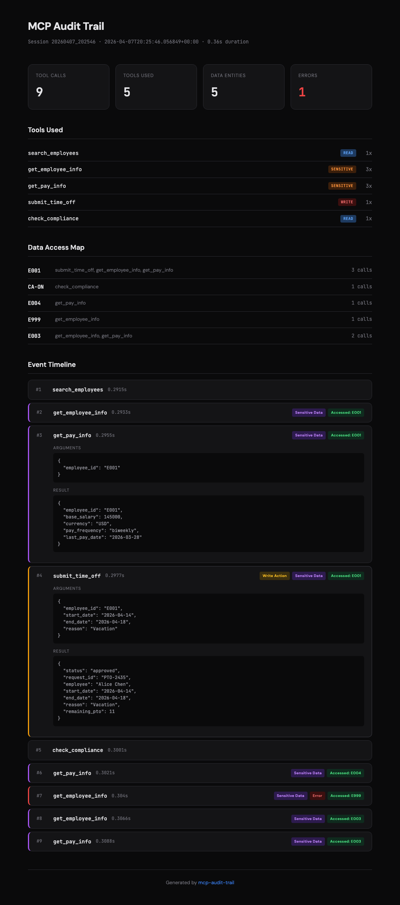
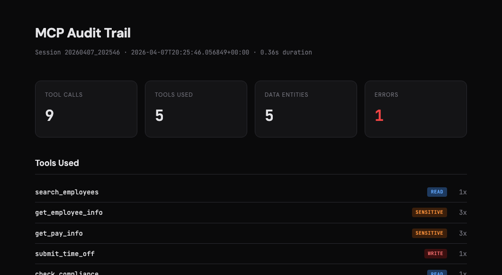
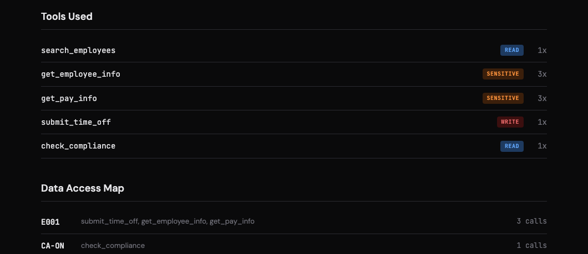
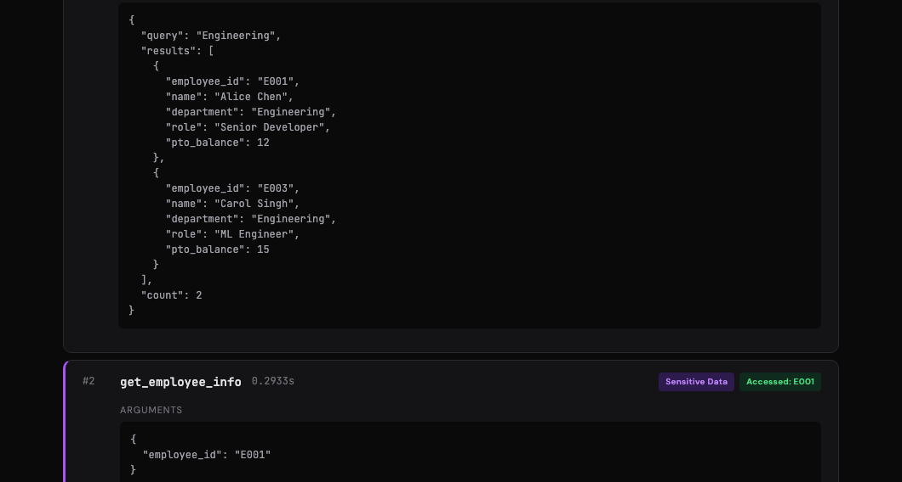

# mcp-audit-trail

Your MCP agent just called 14 tools, accessed employee records, and submitted a PTO request. Do you know what actually happened?

This library sits between any MCP client and server as a transparent proxy, logs every JSON-RPC message, and spits out an HTML report you can actually read. Zero changes to your server code. Zero runtime dependencies.


<p align="center">
  
</p>

---

## The problem

[MCP](https://modelcontextprotocol.io/) gives agents the ability to call tools, query databases, and take real actions. That's great until you need to answer questions like:

- What data did the agent actually read?
- Did it access anything it shouldn't have?
- Which tool call failed, and what arguments did it pass?
- Who approved that PTO request — a human or the model?

Application logs won't tell you this. You need something that understands the MCP protocol itself.

## Install

```bash
pip install mcp-audit-trail
```

No runtime dependencies. Seriously — the core library is pure Python stdlib. You only need the `mcp` SDK if you want to run the included demo server.

## Quickstart

### 1. Proxy your server (nothing to change)

Stick the proxy between your client and server. Both sides think they're talking to each other directly.

```bash
mcp-audit-proxy \
  --server "python my_server.py" \
  --log audit.json \
  --sensitive-tools get_pay_info get_ssn \
  --write-tools submit_time_off delete_record
```

That's it. Every message flows through, gets logged to `audit.json`, and lands on the other side untouched.

### 2. Turn the log into something readable

```bash
mcp-audit-report --input audit.json --output report.html
```

Open `report.html` in a browser:





You get a session summary, tool classification (read/write/sensitive), a data access map, and an interactive timeline — click any event to expand the full arguments and results.

### 3. Or just use it from Python

```python
from mcp_audit_trail import AuditLogger, generate_report

# log some events
logger = AuditLogger(
    "audit.json",
    sensitive_tools={"get_pay_info"},
    write_tools={"submit_time_off"},
)

logger.log("client_to_server", {
    "method": "tools/call",
    "id": 1,
    "params": {"name": "get_pay_info", "arguments": {"employee_id": "E001"}},
})

logger.save()

# render a report from any existing log
generate_report("audit.json", "report.html")
```

If you pass `output_path=None` to `generate_report()`, it returns the HTML string directly instead of writing to disk. Handy if you want to serve it from a web app or pipe it somewhere.

## What gets logged

Every event in the audit log looks roughly like this:

```json
{
  "timestamp": "2026-04-07T10:23:01.442Z",
  "elapsed_seconds": 1.2034,
  "direction": "client_to_server",
  "method": "tools/call",
  "tool_name": "get_pay_info",
  "tool_arguments": { "employee_id": "E001" },
  "flags": ["sensitive"]
}
```

The logger automatically pulls out tool names, arguments, and results from the JSON-RPC messages. It tracks:

- **Tool calls** — name, arguments, result (parsed from `tools/call` requests + responses)
- **Timestamps** — both wall-clock ISO format and elapsed seconds since session start
- **Data entities** — any argument containing `id` or `employee` in the key name gets tracked as an accessed entity
- **Errors** — flagged in both the event and the session summary
- **Direction** — `client_to_server` or `server_to_client`
- **Custom flags** — mark tools as `sensitive` or `write` and they show up tagged in the log and report

The final JSON file also includes a `summary` block at the top with aggregate stats, so you don't have to parse individual events for the common questions.

## Flagging tools

Not all tool calls are equal. Reading a compliance rulebook is different from accessing someone's salary or approving a vacation request.

You can tell the logger (or the CLI) which tools are which:

```bash
mcp-audit-proxy \
  --server "python hr_server.py" \
  --sensitive-tools get_pay_info get_employee_info get_ssn \
  --write-tools submit_time_off delete_record update_profile
```

Or in Python:

```python
logger = AuditLogger(
    "audit.json",
    sensitive_tools={"get_pay_info", "get_employee_info"},
    write_tools={"submit_time_off"},
)
```

Flagged events get tagged in the JSON log and highlighted in the HTML report. Sensitive tools show up in red, write actions in orange. Makes it easy to scan a long session for the stuff that matters.



## CLI reference

**`mcp-audit-proxy`** — transparent stdio proxy

```
mcp-audit-proxy --server COMMAND [--log PATH] [--sensitive-tools TOOLS...] [--write-tools TOOLS...]
```

| Flag | Default | What it does |
|------|---------|-------------|
| `--server` | *(required)* | Shell command to start the MCP server |
| `--log` | `audit_log.json` | Where to write the JSON audit log |
| `--sensitive-tools` | *(none)* | Space-separated list of tools to flag as sensitive |
| `--write-tools` | *(none)* | Space-separated list of tools to flag as write actions |

**`mcp-audit-report`** — HTML report generator

```
mcp-audit-report --input PATH [--output PATH]
```

| Flag | Default | What it does |
|------|---------|-------------|
| `--input` | `audit_log.json` | Path to the JSON audit log |
| `--output` | `audit_report.html` | Where to write the HTML report |

## Python API

Three things are exported from the top-level package:

| Export | What it is |
|--------|-----------|
| `AuditLogger` | The core logger class. Create one, call `.log()` for each message, call `.save()` when you're done. Thread-safe. |
| `run_proxy(server_command, log_path, ...)` | Starts a server subprocess and proxies all stdio through the logger. Blocking — runs until the server exits. |
| `generate_report(input_path, output_path, ...)` | Reads a JSON audit log, writes (or returns) an HTML report. |

```python
from mcp_audit_trail import AuditLogger, run_proxy, generate_report
```

`AuditLogger` is probably what you want if you're integrating into existing code. `run_proxy` is more of a "start and forget" wrapper — it's what the CLI uses under the hood.

## Try the demo

There's a sample HR server in the repo with fake employee data, pay info, compliance rules, and a PTO system. The demo script runs a bunch of tool calls against it and generates a report.

```bash
git clone https://github.com/khushidahi/mcp-audit-trail.git
cd mcp-audit-trail
pip install -e ".[demo]"
python -m examples.run_demo
```

Then open `audit_report.html`. The demo covers the main scenarios: regular reads, sensitive data access, write actions, cross-department lookups, and an error case (querying an employee that doesn't exist).

## Running tests

```bash
pip install -e ".[dev]"
pytest
```

There are ~55 tests covering the logger, report generator, CLI, and a full integration test that runs real MCP tool calls against the sample server.

## Project layout

```
mcp_audit_trail/
    __init__.py         → public API (AuditLogger, run_proxy, generate_report)
    proxy.py            → the audit logger + stdio proxy
    report.py           → HTML report generator
    cli.py              → CLI entry points
examples/
    sample_server.py    → demo MCP server with HR tools
    run_demo.py         → end-to-end demo script
tests/                  → pytest suite
pyproject.toml          → package config (hatchling)
```

## Known limitations

- The proxy works over stdio only — no SSE/HTTP transport yet
- Entity detection is heuristic (looks for `id` / `employee` in argument keys). Works well for common patterns but won't catch everything
- The HTML report is self-contained (no external assets) but it's not designed for logs with thousands of events — it'll work, just gets long
- No built-in log rotation or multi-session merging

## License

MIT — do whatever you want with it.

---

If you run into issues or have ideas, [open an issue](https://github.com/khushidahi/mcp-audit-trail/issues). PRs welcome.
